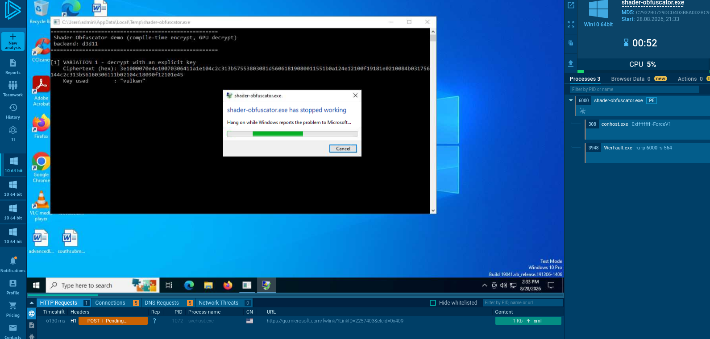

# Shader Obfuscator

A single-header C++17 library that hides strings from `strings(1)` and casual
static analysis by encrypting them at compile time and decrypting them at
runtime **on the GPU**.

## Why

I have been researching malware anti-analysis techniques and the idea of
utilizing the GPU instead of the CPU seemed interesting to me so i experimented
a bit and made this POC.

GPU-based obfuscation is designed to break emulation and basic sandboxes.

The technique exploits the fact that:

- Most sandboxes and CPU emulators (Unicorn, QEMU-based sandboxes, x86 emulation
  in tools like CAPE) only emulate the CPU instruction stream. They have no GPU
  device model at all.

- If the decryption routine offloads the actual rc4/XOR/whatever work to a
  compute kernel via vulkan and d3d11 api, a pure-CPU emulator either:
  - Fails the API call (no real GPU driver present) and the malware branches to
    a bail-out/sleep path, or
  - Hangs/errors out because the emulator doesn't know how to service the driver
	call at all.  Either way, the strings never get decrypted in that
	environment, so string-based detection, static "decrypt and dump" scripts,
	and behavioral sandboxes that rely on seeing plaintext IOCs all come up
	empty.



## Trade-offs

From the malware author's side, this technique trades stealth for a lot of
fragility. Downsides:

- Requires an actual GPU with a compatible driver. A huge share of real-world
  targets (servers, VDI instances, budget laptops, virtualized corporate
  endpoints, etc...) have no discrete GPU or only a basic integrated one without
  full compute driver support installed.
- If the target has no GPU/driver, the malware's decryption never succeeds, so
  the payload simply fails to execute correctly on a meaningful fraction of
  intended victims. That's a self-inflicted loss of reach that pure-CPU crypto
  doesn't have.
- Loading `d3d11.dll` or vulkan from a process that has no legitimate reason to
  touch a GPU is itself an anomalous, fairly rare signal and easy for the EDR to
  flag.


## What it does

- You write `shobf::decrypt(SHOBF_OBFUSCATE("Hello, world!", "key"))` in plain
  C++.
- At compile time the literal is encrypted into opaque ciphertext bytes — the
  plaintext never exists in the binary.
- At runtime a tiny GPU compute shader (Vulkan, or Direct3D 11 on Windows)
  decrypts it back, so a reverse engineer has to chase the data through the GPU
  to recover it.


## Usage

See `crackme.cpp` and `main.cpp` as example usages.

### Encrypting strings

```cpp
// XOR cipher (default)
std::string a = shobf::decrypt(SHOBF_OBFUSCATE("secret", "key"));

// RC4 cipher
std::string b = shobf::decrypt(SHOBF_OBFUSCATE_RC4("secret", "key"),
                               "key", shobf::Algorithm::Rc4);

// Auto: key derived from SHOBF_BUILD_SEED — no key literal in your source
std::string c = shobf::decryptAuto(SHOBF_OBFUSCATE("secret", shobf::seedKey()));
```

A complete program with a runtime flag check:

```cpp
#include "shader_obfuscate.hpp"
#include <iostream>
#include <string>

int main()
{
    // Compile-time encrypted; SHOBF_BUILD_SEED is the only secret in the binary.
    const auto obfFlag = SHOBF_OBFUSCATE("FLAG{sh4d3r_0bfusc4t3d}", shobf::seedKey());
    const std::string flag = shobf::decryptAuto(obfFlag);

    std::string guess;
    std::cout << "Enter flag: ";
    std::getline(std::cin, guess);

    std::cout << (guess == flag ? "Correct!" : "Wrong!") << std::endl;
}
```


## Quick start

```sh
cmake -S . -B build
cmake --build build -j
./build/crackme          # guess: vulk4n_1s_n0t_crypt0
./build/shader-obfuscator
```

Or build just one target:

```sh
cmake --build build --target crackme
```

## Building on Linux

The default Vulkan backend builds natively on Linux with g++ or clang++ and a
Vulkan SDK (or distro Vulkan headers + loader). No D3D11 here — the Direct3D 11
backend is Windows-only (the header `#errors` on non-Windows). Requirements:
CMake ≥ 3.16, a C++17 compiler, and the Vulkan headers/loader (e.g.
`vulkan-headers` / `vulkan-loader` on most distros).

```sh
cmake -S . -B build
cmake --build build -j
./build/crackme          # guess: vulk4n_1s_n0t_crypt0
./build/shader-obfuscator
```

A clean release-only build of a single target:

```sh
cmake -S . -B build -DCMAKE_BUILD_TYPE=Release
cmake --build build --target crackme -j
```

## Building on Windows

The repo builds natively on Windows with either Visual Studio (MSVC) or
MinGW-w64. Decide on a backend first: Vulkan (default) or Direct3D 11.

**Vulkan backend** — needs the Vulkan SDK (CMake reads `VULKAN_SDK`) plus
CMake ≥ 3.16. CMake picks the Visual Studio generator automatically; with a
multi-config generator pass `--config Release`:

```sh
cmake -S . -B build
cmake --build build --config Release -j
build\Release\crackme.exe          # guess: vulk4n_1s_n0t_crypt0
build\Release\shader-obfuscator.exe
```

With MinGW-w64 instead:

```sh
cmake -S . -B build -G "MinGW Makefiles" -DCMAKE_BUILD_TYPE=Release
cmake --build build -j
build\crackme.exe
```

**Direct3D 11 backend** (`d3d11.dll` ships with Windows, no Vulkan SDK needed):

```sh
cmake -S . -B build-d3d -DSHOBF_BACKEND_D3D11=ON
cmake --build build-d3d --config Release
build-d3d\Release\crackme.exe
```

To embed a precompiled shader so no HLSL text ends up in the binary, add
`-DSHOBF_D3D11_PRECOMPILED=ON`. CMake runs `build_shader.py`, which needs
Python 3 and builds the helper (`gen_shader_dxbc.cpp`) with MinGW-w64 `g++`
when available, falling back to the MSVC toolchain (`cl.exe` under
`vcvarsall.bat`, auto-detected via vswhere / the standard install paths; set
`SHOBF_MSVC_VCVARS` to a specific `vcvarsall.bat` to override). A MinGW + wine64
setup is still required on Linux cross-builds.

The precompiled blob is produced without `D3DCOMPILE_DEBUG`, so the HLSL source
is not embedded in it, and Release builds (which auto-define `SHOBF_NO_DEBUG`)
plus MSVC's `/GR-` keep error-message strings and `shobf` RTTI type names out of
the binary too.

## Configuration

`shader_obfuscate.hpp` is a single-header library — every option is a macro
you `#define` **in your source, before** `#include "shader_obfuscate.hpp"`. In
this repo the CMake project drives most of them for you: pass them as cache
options on the `cmake` command line, which CMake forwards as compile
definitions (equivalent to a `#define` before the include).

```sh
cmake -S . -B build -DSHOBF_BACKEND_D3D11=ON -DSHOBF_D3D11_PRECOMPILED=ON
```

| Define / option | What it does |
|--------|--------------|
| `SHOBF_BACKEND_D3D11` | Use the Direct3D 11 backend instead of the default Vulkan. Compiling on a non-Windows target fails with a clear `#error`. |
| `SHOBF_D3D11_PRECOMPILED` | Only with `SHOBF_BACKEND_D3D11`. Embed a prebuilt DXBC blob (from `build_shader.py`, compiled without `D3DCOMPILE_DEBUG`) so no HLSL text ships. Runtime needs only `d3d11.dll`. |
| `SHOBF_NO_DEBUG` | Release build: no validation messages, no exceptions — failures silently return empty. CMake's `Release`/`RelWithDebInfo`/`MinSizeRel` build types define it automatically. |
| `SHOBF_BUILD_SEED` | 64-bit seed for the session key used by `decryptAuto`. Same seed ⇒ same key on every OS and rebuild. Set it in source (as in `crackme.cpp`). |

If `SHOBF_BUILD_SEED` is omitted, the header hashes `__DATE__`/`__TIME__`, so
the key changes on every rebuild.

## The crackme example

`crackme.cpp` is a small game that decrypts its banner, prompt, secret
passphrase, and win/fail messages on the GPU at runtime. A stripped build has
zero plaintext strings and zero symbols — only ciphertext and the seed:

```sh
cmake --build build --target crackme -j     # built by the default config

strings build/crackme | grep -c passphrase  # 0
./build/crackme                             # guess: vulk4n_1s_n0t_crypt0
```

To cross-compile a Windows/D3D11 build from Linux, configure with CMake and a
MinGW toolchain file and set `SHOBF_BACKEND_D3D11=ON` (add
`SHOBF_D3D11_PRECOMPILED=ON` to embed a prebuilt shader — CMake runs
`build_shader.py` automatically). Building natively on Windows is covered in
[Building on Windows](#building-on-windows):

```sh
cmake -S . -B build-d3d -DCMAKE_TOOLCHAIN_FILE=/path/to/mingw-w64.cmake \
      -DSHOBF_BACKEND_D3D11=ON -DSHOBF_D3D11_PRECOMPILED=ON
cmake --build build-d3d
printf "vulk4n_1s_n0t_crypt0\n" | wine64 build-d3d/crackme.exe
```

## Requirements

- C++17 compiler (g++ / clang++ / MinGW-w64 / MSVC), CMake ≥= 3.16, and python.
- **Vulkan** (default): Vulkan headers + loader and a GPU with a compute queue.
- **D3D11** (`SHOBF_BACKEND_D3D11`, Windows): `d3d11.dll`. Precompiled mode
  (`SHOBF_D3D11_PRECOMPILED`) additionally needs Python 3 and either
  MinGW-w64 `g++` or the MSVC toolchain (found automatically), plus `wine64`
  when cross-compiling on Linux.

## Disclaimer

This project is intended **strictly for research purposes**.

It was developed to explore GPU-based obfuscation techniques, anti-analysis
methods, and the practical challenges of offloading decryption to graphics
hardware.


## AI Disclosure

This project was developed with the assistance of AI-powered tools for code
generation, documentation, and debugging. The underlying research, threat
modeling, and obfuscation techniques are the original work of the author.

## License

MIT License.
